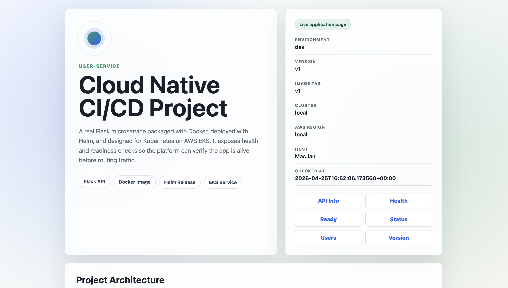
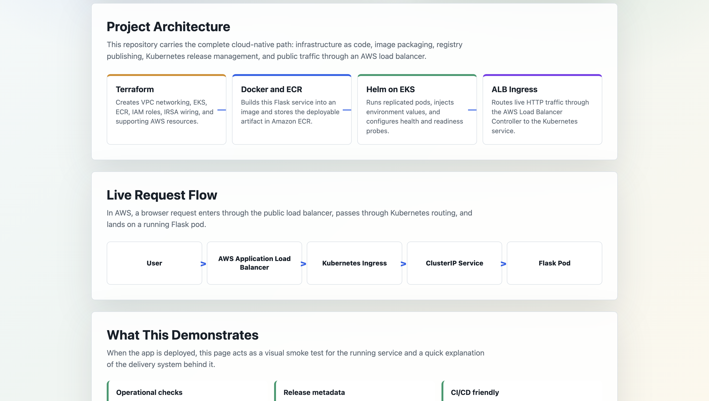
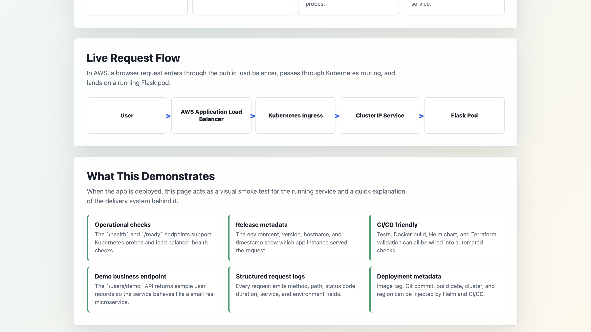
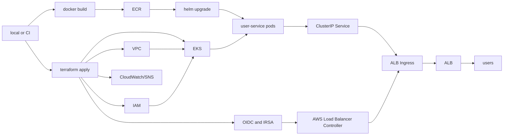

# Cloud Native CI/CD Project on AWS EKS

[](https://github.com/sashank1064/cloud-native-ci-cd/actions/workflows/ci.yml)

End-to-end cloud-native deployment project for a Flask microservice on AWS EKS.

I built this to keep the whole path in one repo: AWS infra, image build, ECR push, Helm deploy, and a CI check that catches the obvious stuff before anything gets merged.

## What I Built

I built a containerized Flask `user-service` and deployed it with a production-style cloud workflow: Terraform provisions AWS infrastructure, Docker packages the app, ECR stores the image, Helm deploys it to Kubernetes, and an AWS Application Load Balancer exposes it through Ingress.

The application itself is not just a blank health check. It includes a live preview page, architecture explanation, request-flow diagram, release metadata, structured request logs, health/readiness endpoints, and a demo user API so the deployed service behaves like a small real microservice.

## App Preview

When running locally or through the ALB, the root page shows the project name, service status, deployment metadata, project architecture, request flow, and useful endpoint links.

### Live application page



### Architecture and request flow



### Deployment features



## What is here

- Terraform modules for VPC, EKS, ECR, IAM, and a small ALB alarm hook
- Flask app with `/`, `/api/info`, `/status`, `/users/demo`, `/health`, and `/ready`
- Dockerfile for the app
- Helm chart for deployment, service, probes, and ALB ingress
- EKS access entries for the local deploy user
- IRSA wiring for the AWS Load Balancer Controller
- GitHub Actions CI
- Manual deploy workflow
- Makefile plus `scripts/deploy.sh` for local runs

## Architecture



## Live Request Flow

```text
User browser
  -> AWS Application Load Balancer
  -> Kubernetes Ingress
  -> Kubernetes ClusterIP Service
  -> Flask pod running Gunicorn
```

## Application Endpoints

| Endpoint | Purpose |
| --- | --- |
| `/` | Animated project preview with architecture, request flow, and runtime details |
| `/api/info` | JSON summary of service, architecture, release metadata, and endpoints |
| `/status` | Human-readable operational status as JSON |
| `/users/demo` | Mock user API to make the service behave like a real microservice |
| `/health` | Liveness check for Kubernetes and ALB health checks |
| `/ready` | Readiness check for Kubernetes traffic routing |
| `/version` | Release metadata such as version, image tag, commit, and build date |

## Release Metadata

The Helm deployment can inject these values into the pod:

```text
PROJECT_NAME
SERVICE_NAME
ENVIRONMENT
VERSION
IMAGE_TAG
GIT_COMMIT
BUILD_DATE
AWS_REGION
CLUSTER_NAME
```

This makes the live page useful during demos because it shows which image, commit, region, and cluster served the request.

## Layout

```text
.github/workflows/       ci and manual deploy
cicd/                    Jenkinsfile, mostly for comparison
helm/user-service/       chart for the Flask service
microservices/user-service/
scripts/deploy.sh        local build/push/deploy script
terraform/               AWS resources
Makefile                 shortcuts I actually use
```

## CI/CD

CI runs on `main` and pull requests:

```text
pytest
terraform init -backend=false
terraform fmt -check -recursive
terraform validate
helm lint
docker build
```

Deploy is manual. It expects an image tag and runs Helm against the EKS cluster.

For local work:

```bash
make build
make push
make deploy
```

## Demo Runbook

Use this when someone asks to see the project running live.

### 1. One-time setup

Create local config files:

```bash
cp .env.example .env
cp terraform/terraform.tfvars.example terraform/terraform.tfvars
```

Fill in `.env` with your AWS account:

```bash
AWS_REGION=us-east-1
AWS_ACCOUNT_ID=123456789012
CLUSTER_NAME=cicd-eks-cluster
ECR_REPOSITORY=cloud-native-cicd/user-service
IMAGE_TAG=demo
DOCKER_PLATFORM=linux/amd64
```

Make sure your AWS CLI points at that same account:

```bash
aws sts get-caller-identity
```

### 2. Create AWS infrastructure

Run this before the demo. EKS can take several minutes to create.

```bash
terraform -chdir=terraform init
terraform -chdir=terraform fmt -recursive
terraform -chdir=terraform validate
terraform -chdir=terraform plan -out tfplan
terraform -chdir=terraform apply tfplan
```

Connect kubectl:

```bash
aws eks update-kubeconfig --region "$AWS_REGION" --name "$CLUSTER_NAME"
kubectl get nodes
```

Install the AWS Load Balancer Controller:

```bash
make install-lbc
```

### 3. Preflight right before showing it

This checks local tools, tests, Helm, Terraform formatting, AWS account, EKS, ECR, node access, and the Load Balancer Controller.

```bash
make preflight
```

If preflight passes, deploy the app:

```bash
IMAGE_TAG=demo-$(date +%Y%m%d%H%M%S) make deploy
```

The deploy script prints the ALB URL when the Ingress gets an address. You can also get it later:

```bash
make status
make url
```

Open:

```text
http://<alb-dns-name>/
http://<alb-dns-name>/health
http://<alb-dns-name>/api/info
```

What to show:

- The root page as the visual proof of the running service
- `/health` and `/ready` for Kubernetes probes
- `/api/info` or `/version` for release metadata
- `kubectl get pods,svc,ingress` to show the Kubernetes resources
- The AWS console load balancer if you want to show the public entry point

## Setup

Tools I used:

```bash
aws --version
terraform version
docker --version
helm version
kubectl version --client
```

Create local config files if you have not already:

```bash
cp .env.example .env
cp terraform/terraform.tfvars.example terraform/terraform.tfvars
```

Fill in `.env`:

```bash
AWS_REGION=us-east-1
AWS_ACCOUNT_ID=123456789012
CLUSTER_NAME=cicd-eks-cluster
ECR_REPOSITORY=cloud-native-cicd/user-service
IMAGE_TAG=latest
DOCKER_PLATFORM=linux/amd64
```

For a small test, keep the node group tiny:

```hcl
desired_size   = 1
min_size       = 1
max_size       = 1
instance_types = ["t3.small"]
alert_email    = ""
```

EKS and NAT gateways are billed. I destroy this after testing.

`DOCKER_PLATFORM=linux/amd64` keeps local builds compatible with the default EKS managed node architecture. This matters on Apple Silicon Macs because the default local Docker build can otherwise produce an ARM image that EKS x86 nodes cannot pull.

## Manual Deploy Reference

Create the AWS resources:

```bash
terraform -chdir=terraform init
terraform -chdir=terraform fmt -recursive
terraform -chdir=terraform validate
terraform -chdir=terraform plan -out tfplan
terraform -chdir=terraform apply tfplan
```

Connect kubectl:

```bash
set -a
source .env
set +a

aws eks update-kubeconfig --region "$AWS_REGION" --name "$CLUSTER_NAME"
kubectl get nodes
```

Install the AWS Load Balancer Controller:

```bash
helm repo add eks https://aws.github.io/eks-charts
helm repo update

helm upgrade --install aws-load-balancer-controller eks/aws-load-balancer-controller \
  --namespace kube-system \
  --set clusterName="$CLUSTER_NAME" \
  --set region="$AWS_REGION" \
  --set vpcId="$(terraform -chdir=terraform output -raw vpc_id)" \
  --set-string "serviceAccount.annotations.eks\.amazonaws\.com/role-arn=$(terraform -chdir=terraform output -raw aws_load_balancer_controller_role_arn)"
```

Terraform creates the EKS OIDC provider and IAM role used by this annotation. Without that role, the controller cannot create the AWS Application Load Balancer for the Ingress.

Deploy the service:

```bash
helm lint helm/user-service
docker build -t user-service:local microservices/user-service

make build
make push
make deploy
```

Check it:

```bash
kubectl get pods
kubectl get svc
kubectl get ingress
curl http://<alb-dns-name>/health
```

## Cleanup

Remove the Helm release first so the ALB gets deleted:

```bash
helm uninstall user-service --namespace default
kubectl get ingress
```

Then remove the rest:

```bash
helm uninstall aws-load-balancer-controller --namespace kube-system
terraform -chdir=terraform destroy
```

Quick leftover check:

```bash
aws elbv2 describe-load-balancers --region "$AWS_REGION"
aws ec2 describe-nat-gateways --region "$AWS_REGION"
aws ec2 describe-addresses --region "$AWS_REGION"
aws eks list-clusters --region "$AWS_REGION"
aws ecr describe-repositories --region "$AWS_REGION"
```
