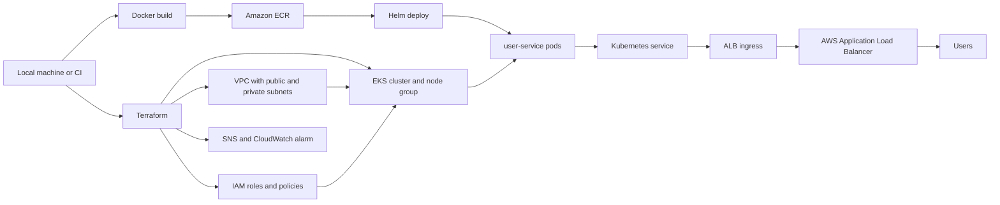

# Project 2: Cloud Native CI/CD on AWS EKS

This is my second DevOps project. I built it to practice the full path from infrastructure to deployment instead of only showing separate Terraform or Docker examples.

It runs a small Flask service on EKS. Terraform creates the AWS infrastructure, Docker builds the app image, ECR stores the image, and Helm deploys it into the cluster.

I kept the setup simple on purpose. There are still a few things I would tighten before calling it a real production setup, but the core workflow is here and works as a practical EKS deployment project.

## Architecture



## What is in the repo

- `terraform/` creates the VPC, EKS cluster, node group, ECR repo, IAM roles, and a small alarm setup.
- `microservices/user-service/` has the Flask app and Dockerfile.
- `helm/user-service/` has the Kubernetes deployment, service, probes, and ingress.
- `.github/workflows/` has CI checks and a manual deploy workflow.
- `scripts/deploy.sh` builds the image, pushes it to ECR, and deploys with Helm.
- `Makefile` wraps the common commands I kept typing.

## CI/CD flow

The CI workflow is intentionally basic:

- run Python tests
- validate Terraform
- lint the Helm chart
- build the Docker image

The deploy workflow is manual. I pass an image tag, GitHub Actions updates kubeconfig, and Helm updates the release.

For local testing I usually use:

```bash
make build
make push
make deploy
```

There is also a Jenkinsfile in `cicd/`. I added it because I wanted to show the same rough flow in Jenkins, but GitHub Actions is the cleaner path for this repo.

## Tools needed

```bash
aws --version
terraform version
docker --version
helm version
kubectl version --client
```

## Local config

Copy the examples:

```bash
cp .env.example .env
cp terraform/terraform.tfvars.example terraform/terraform.tfvars
```

Fill in `.env`:

```bash
AWS_REGION=us-east-1
AWS_ACCOUNT_ID=123456789012
CLUSTER_NAME=cicd-eks-cluster
ECR_REPOSITORY=cloud-native-cicd/user-service
IMAGE_TAG=latest
```

For a small test run, I use this in `terraform/terraform.tfvars`:

```hcl
desired_size   = 1
min_size       = 1
max_size       = 1
instance_types = ["t3.small"]
alert_email    = ""
```

EKS and NAT gateways are not free. I do not leave this running after testing.

## Deploy from scratch

Create the AWS resources:

```bash
terraform -chdir=terraform init
terraform -chdir=terraform fmt -recursive
terraform -chdir=terraform validate
terraform -chdir=terraform plan -out tfplan
terraform -chdir=terraform apply tfplan
```

Connect kubectl:

```bash
set -a
source .env
set +a

aws eks update-kubeconfig --region "$AWS_REGION" --name "$CLUSTER_NAME"
kubectl get nodes
```

Install the AWS Load Balancer Controller:

```bash
helm repo add eks https://aws.github.io/eks-charts
helm repo update

helm upgrade --install aws-load-balancer-controller eks/aws-load-balancer-controller \
  --namespace kube-system \
  --set clusterName="$CLUSTER_NAME" \
  --set region="$AWS_REGION" \
  --set vpcId="$(terraform -chdir=terraform output -raw vpc_id)"
```

Deploy the service:

```bash
helm lint helm/user-service
docker build -t user-service:local microservices/user-service

make build
make push
make deploy
```

Check what happened:

```bash
kubectl get pods
kubectl get svc
kubectl get ingress
```

Once the ingress has an ALB address:

```bash
curl http://<alb-dns-name>/health
curl http://<alb-dns-name>/
```

## Cleanup

Delete the app first so the ALB can disappear cleanly:

```bash
helm uninstall user-service --namespace default
kubectl get ingress
```

Then remove the rest:

```bash
helm uninstall aws-load-balancer-controller --namespace kube-system
terraform -chdir=terraform destroy
```

After destroy I usually check for leftovers:

```bash
aws elbv2 describe-load-balancers --region "$AWS_REGION"
aws ec2 describe-nat-gateways --region "$AWS_REGION"
aws ec2 describe-addresses --region "$AWS_REGION"
aws eks list-clusters --region "$AWS_REGION"
```
