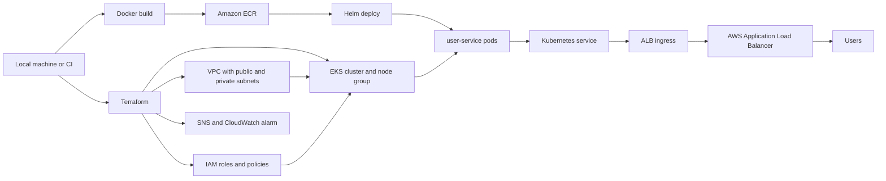

# Project 2: Cloud Native CI/CD on AWS EKS

A small end-to-end DevOps project that deploys a Flask service to Amazon EKS.

The goal was to keep the moving parts realistic but still readable: Terraform builds the AWS infrastructure, Docker packages the app, ECR stores the image, and Helm handles the Kubernetes release.

## What this project shows

- Terraform modules for VPC, EKS, ECR, IAM, and basic ALB alerting.
- A Dockerized Flask service with health and readiness endpoints.
- Helm templates for deployment, service, probes, and ALB ingress.
- GitHub Actions for tests, Terraform validation, Helm lint, and Docker build.
- A local `Makefile` and deploy script for build, push, and deploy.

## Architecture



## Repository layout

```text
.
├── .github/workflows/       # CI and manual deploy workflow
├── cicd/                    # Jenkins pipeline example
├── helm/user-service/       # Helm chart
├── microservices/user-service/
│   ├── app.py
│   ├── Dockerfile
│   └── tests/
├── scripts/deploy.sh
├── terraform/               # AWS infrastructure
├── Makefile
└── README.md
```

## CI/CD flow

The CI workflow runs on pull requests and pushes to `main`:

1. Install Python dependencies.
2. Run unit tests.
3. Run `terraform init -backend=false`.
4. Run `terraform fmt -check -recursive`.
5. Run `terraform validate`.
6. Run `helm lint`.
7. Build the Docker image.

Deployment is manual. The deploy workflow takes an image tag, updates kubeconfig, and runs `helm upgrade --install`.

Local deployment uses the same basic path:

```bash
make build
make push
make deploy
```

## Tools needed

```bash
aws --version
terraform version
docker --version
helm version
kubectl version --client
```

## Local config

Copy the example files:

```bash
cp .env.example .env
cp terraform/terraform.tfvars.example terraform/terraform.tfvars
```

Fill in `.env`:

```bash
AWS_REGION=us-east-1
AWS_ACCOUNT_ID=123456789012
CLUSTER_NAME=cicd-eks-cluster
ECR_REPOSITORY=cloud-native-cicd/user-service
IMAGE_TAG=latest
```

For a small test run, use one worker node in `terraform/terraform.tfvars`:

```hcl
desired_size   = 1
min_size       = 1
max_size       = 1
instance_types = ["t3.small"]
alert_email    = ""
```

EKS and NAT gateways cost money. Destroy the stack after testing.

## Deploy from scratch

Create the AWS resources:

```bash
terraform -chdir=terraform init
terraform -chdir=terraform fmt -recursive
terraform -chdir=terraform validate
terraform -chdir=terraform plan -out tfplan
terraform -chdir=terraform apply tfplan
```

Connect kubectl:

```bash
set -a
source .env
set +a

aws eks update-kubeconfig --region "$AWS_REGION" --name "$CLUSTER_NAME"
kubectl get nodes
```

Install the AWS Load Balancer Controller:

```bash
helm repo add eks https://aws.github.io/eks-charts
helm repo update

helm upgrade --install aws-load-balancer-controller eks/aws-load-balancer-controller \
  --namespace kube-system \
  --set clusterName="$CLUSTER_NAME" \
  --set region="$AWS_REGION" \
  --set vpcId="$(terraform -chdir=terraform output -raw vpc_id)"
```

Deploy the service:

```bash
helm lint helm/user-service
docker build -t user-service:local microservices/user-service

make build
make push
make deploy
```

Check the app:

```bash
kubectl get pods
kubectl get svc
kubectl get ingress
curl http://<alb-dns-name>/health
```

## Cleanup

Delete the app first so the ALB can disappear cleanly:

```bash
helm uninstall user-service --namespace default
kubectl get ingress
```

Then remove the rest:

```bash
helm uninstall aws-load-balancer-controller --namespace kube-system
terraform -chdir=terraform destroy
```

Check for leftovers:

```bash
aws elbv2 describe-load-balancers --region "$AWS_REGION"
aws ec2 describe-nat-gateways --region "$AWS_REGION"
aws ec2 describe-addresses --region "$AWS_REGION"
aws eks list-clusters --region "$AWS_REGION"
```
