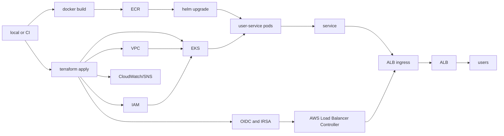

# Project 2: Cloud Native CI/CD on AWS EKS

Small EKS project for one Flask service.

I built this to keep the whole path in one repo: AWS infra, image build, ECR push, Helm deploy, and a CI check that catches the obvious stuff before anything gets merged.

## What is here

- Terraform modules for VPC, EKS, ECR, IAM, and a small ALB alarm hook
- Flask app with `/`, `/health`, and `/ready`
- Dockerfile for the app
- Helm chart for deployment, service, probes, and ALB ingress
- EKS access entries for the local deploy user
- IRSA wiring for the AWS Load Balancer Controller
- GitHub Actions CI
- Manual deploy workflow
- Makefile plus `scripts/deploy.sh` for local runs

## Architecture



## Layout

```text
.github/workflows/       ci and manual deploy
cicd/                    Jenkinsfile, mostly for comparison
helm/user-service/       chart for the Flask service
microservices/user-service/
scripts/deploy.sh        local build/push/deploy script
terraform/               AWS resources
Makefile                 shortcuts I actually use
```

## CI/CD

CI runs on `main` and pull requests:

```text
pytest
terraform init -backend=false
terraform fmt -check -recursive
terraform validate
helm lint
docker build
```

Deploy is manual. It expects an image tag and runs Helm against the EKS cluster.

For local work:

```bash
make build
make push
make deploy
```

## Setup

Tools I used:

```bash
aws --version
terraform version
docker --version
helm version
kubectl version --client
```

Create local config files:

```bash
cp .env.example .env
cp terraform/terraform.tfvars.example terraform/terraform.tfvars
```

Fill in `.env`:

```bash
AWS_REGION=us-east-1
AWS_ACCOUNT_ID=123456789012
CLUSTER_NAME=cicd-eks-cluster
ECR_REPOSITORY=cloud-native-cicd/user-service
IMAGE_TAG=latest
DOCKER_PLATFORM=linux/amd64
```

For a small test, keep the node group tiny:

```hcl
desired_size   = 1
min_size       = 1
max_size       = 1
instance_types = ["t3.small"]
alert_email    = ""
```

EKS and NAT gateways are billed. I destroy this after testing.

`DOCKER_PLATFORM=linux/amd64` keeps local builds compatible with the default EKS managed node architecture. This matters on Apple Silicon Macs because the default local Docker build can otherwise produce an ARM image that EKS x86 nodes cannot pull.

## Deploy

Create the AWS resources:

```bash
terraform -chdir=terraform init
terraform -chdir=terraform fmt -recursive
terraform -chdir=terraform validate
terraform -chdir=terraform plan -out tfplan
terraform -chdir=terraform apply tfplan
```

Connect kubectl:

```bash
set -a
source .env
set +a

aws eks update-kubeconfig --region "$AWS_REGION" --name "$CLUSTER_NAME"
kubectl get nodes
```

Install the AWS Load Balancer Controller:

```bash
helm repo add eks https://aws.github.io/eks-charts
helm repo update

helm upgrade --install aws-load-balancer-controller eks/aws-load-balancer-controller \
  --namespace kube-system \
  --set clusterName="$CLUSTER_NAME" \
  --set region="$AWS_REGION" \
  --set vpcId="$(terraform -chdir=terraform output -raw vpc_id)" \
  --set-string "serviceAccount.annotations.eks\.amazonaws\.com/role-arn=$(terraform -chdir=terraform output -raw aws_load_balancer_controller_role_arn)"
```

Terraform creates the EKS OIDC provider and IAM role used by this annotation. Without that role, the controller cannot create the AWS Application Load Balancer for the Ingress.

Deploy the service:

```bash
helm lint helm/user-service
docker build -t user-service:local microservices/user-service

make build
make push
make deploy
```

Check it:

```bash
kubectl get pods
kubectl get svc
kubectl get ingress
curl http://<alb-dns-name>/health
```

## Cleanup

Remove the Helm release first so the ALB gets deleted:

```bash
helm uninstall user-service --namespace default
kubectl get ingress
```

Then remove the rest:

```bash
helm uninstall aws-load-balancer-controller --namespace kube-system
terraform -chdir=terraform destroy
```

Quick leftover check:

```bash
aws elbv2 describe-load-balancers --region "$AWS_REGION"
aws ec2 describe-nat-gateways --region "$AWS_REGION"
aws ec2 describe-addresses --region "$AWS_REGION"
aws eks list-clusters --region "$AWS_REGION"
aws ecr describe-repositories --region "$AWS_REGION"
```
